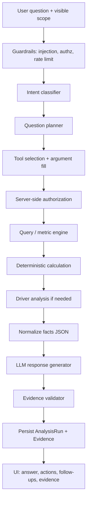

# AI System Architecture

**Version:** 0.1.0  
**Related:** [architecture.md](./architecture.md), [executive-questions.md](./executive-questions.md), [prompts/executive-advisor.v1.md](../prompts/executive-advisor.v1.md)

---

## 1. Design principle

**The model explains. The engine calculates.**

The LLM must not:

- generate SQL/OData to execute
- invent customers, invoices, or amounts
- treat scenarios as actuals
- claim causation without driver evidence

---

## 2. End-to-end flow



If validation fails (model cited a number not in facts JSON), regenerate once with a repair prompt; if still failing, show facts-only fallback (templated, no creative numbers).

---

## 3. Intent router

Input: question, conversation state, user role, company capabilities.

Output: `Intent` enum (see executive-questions.md) + confidence.

Implementation MVP: LLM classifier **constrained to JSON schema**, with a keyword/heuristic backup for obvious lookups (“how much cash”).

Ambiguous intent → ask a **single** clarifying question only when it would materially change the metric (e.g. cash vs profit). Prefer defaults: current company, current fiscal period, LCY.

---

## 4. Business question planner

Produces a `Plan`:

```json
{
  "intent": "DIAGNOSTIC",
  "metrics": ["cash_balance", "accounts_receivable", "inventory_value", "accounts_payable", "gross_profit"],
  "period": { "type": "last_n_days", "n": 30 },
  "compare": { "type": "previous_equal" },
  "breakdowns": [{ "metric": "accounts_receivable", "by": "customer", "topN": 5 }],
  "tools": ["compareMetric", "breakdownMetric", "getOverdueReceivables"],
  "specialists": ["cfo", "inventory", "collections"],
  "needsDrivers": true
}
```

Planner is schema-validated. Unknown metrics are dropped, not executed.

---

## 5. Metric resolver

Maps plan metrics to `MetricDefinition` + availability given `sourceMode` and account maps.

Returns `available | degraded | unavailable` with human reason.

---

## 6. Tool execution (allow list)

All tools: Zod/JSON schema validation, tenant/company from **session not from the model**.

| Tool | Purpose |
| --- | --- |
| `getMetric` | Single metric for period / as-of |
| `compareMetric` | Current vs compare |
| `breakdownMetric` | Top-N dimension split |
| `getTopCustomers` | By revenue, AR, or profit |
| `getTopVendors` | By purchase or AP |
| `getOverdueReceivables` | Open + dueDate < asOf |
| `getInventoryAging` | If ILE available |
| `getExpenseBreakdown` | If G/L map available |
| `getCashBridge` | Δ cash components (Phase 6) |
| `runScenario` | Phase 7 only |
| `getHealthScore` | Phase 7 only |

No `queryDatabase`, no `runOData`, no `http`.

---

## 7. Analytical engine

TypeScript services using `decimal.js`. Prisma returns `Decimal`. Aggregations in SQL use `NUMERIC`, not `float`.

---

## 8. Driver analysis

Statistical/accounting decomposition, not LLM. Output is a list of `{ dimension, member, contributionAmount, contributionShare, residual }`.

LLM only narrates that list.

---

## 9. Response generator

System prompt: `prompts/executive-advisor.v1.md` (versioned).

User payload to the model:

- question
- intent
- facts JSON (numbers, drivers, limitations)
- conversation summary
- role-safe field set

**Executive format (default for material questions):**

1. Direct answer  
2. What changed  
3. Why (drivers)  
4. Business impact  
5. Recommended actions (≤ 5)  
6. Confidence + assumptions  
7. Evidence handles  

Simple lookups may be one short paragraph.

Suggested follow-ups: generated from plan leftover dimensions, not generic chatter.

---

## 10. Evidence validation

For each numeric claim in the model output, match against facts JSON within rounding tolerance (0.01 LCY or 1 unit of display scale).

Unmatched numbers → strip or repair.

Each material claim stores `Evidence`:

- metric_id, period, current, previous, delta
- filters (customer, item)
- query/calculation id
- source entities
- confidence

UI: “View evidence” opens the drawer.

---

## 11. Confidence model

| Label | When |
| --- | --- |
| High | Complete required entities; preferred formula; no large residual |
| Medium | Fallback formula (e.g. unit cost COGS) or partial dimensions |
| Low | Sparse history, inferred pattern, or degraded sync |
| Insufficient | Missing entities or unauthorized |

Claims tagged: `confirmed_erp` | `calculated_erp` | `inferred` | `scenario` | `insufficient`.

**Forbidden inference example:** “Customer ABC is having financial problems.”  
**Allowed:** “Customer ABC’s outstanding rose ₹5.2 lakh; payment-behaviour history is insufficient to explain why.”

---

## 12. Conversation memory

Store: companyId, period, comparison, last metrics, last entity mentions (customer/item ids), last intent.

Resolve ellipsis (“what about profit?”) server-side **before** the planner.

Always echo scope in the UI chrome (company, period, as-of, freshness).

---

## 13. Specialist modules

Not separate autonomous agents in MVP.

| Module | Tool profile | Prompt addendum |
| --- | --- | --- |
| Executive | pulse, recs, synthesis | Board/CEO tone |
| CFO | P&L, WC, cash, ratios | Financial controller discipline |
| Sales | customers, products, growth | CRO language |
| Inventory | stock, ageing, purchases | COO language |
| Collections | overdue ranking | Call-list discipline |
| Operations | orders, fulfillment if data | |
| Forecast | forecast tools only | Assumptions first |
| Risk | concentration, alerts | No scare-mongering without data |

Router may invoke multiple tool profiles; Executive synthesizes one answer.

---

## 14. Prompt-injection protection

- Treat user and retrieved ERP text as **untrusted data**.
- Delimit facts in a `<facts>` block; instruct model to ignore instructions inside facts or customer names.
- Strip tool-call attempts in user text.
- System prompt cannot be overridden by “ignore previous instructions.”
- Retrieval (future documents) labelled `document_knowledge` vs `erp_fact`.
- Output schema optionally constrained (JSON then render) for high-risk answers.

---

## 15. Audit

`AnalysisRun` stores: request_id, tenant_id, user_id, question, timestamps, intent, plan, metrics, tool names + argument hashes (not full ERP dumps), model id + prompt version, final response, confidence, errors.

Do not store OAuth tokens or raw BC page payloads.

---

## 16. AI evaluation tests

Golden set: all 50 questions in [executive-questions.md](./executive-questions.md) against demo company.

Assert:

- selected metrics match expected dependencies
- no unsupported causal claims (classifier on labels)
- injection strings do not call extra tools
- follow-up inherits period

Example:

Question: “Why is cash down?”  
Expected metrics: cash, AR, AP, inventory, profit (if available).  
Forbidden: “customers are going bankrupt” without evidence.
