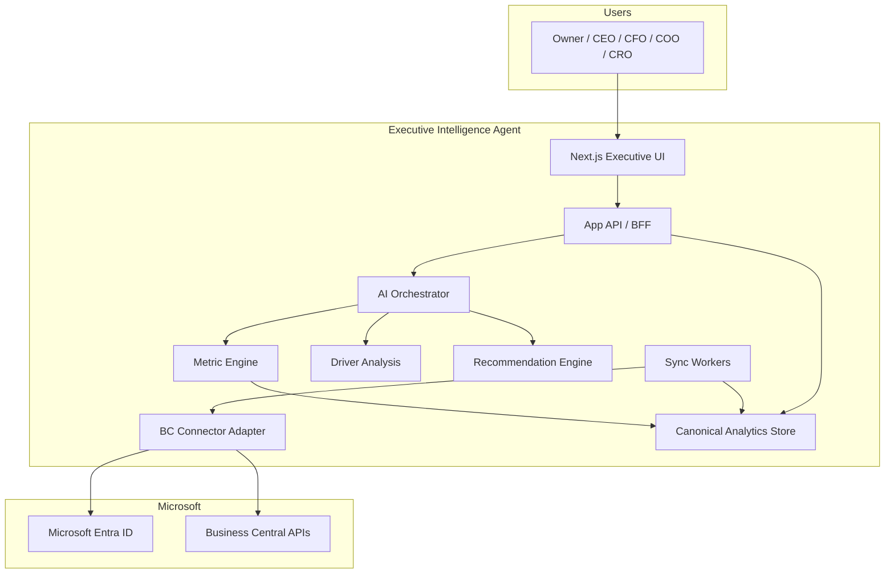
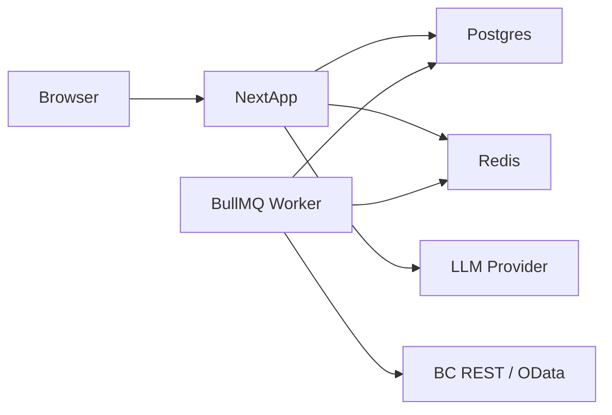
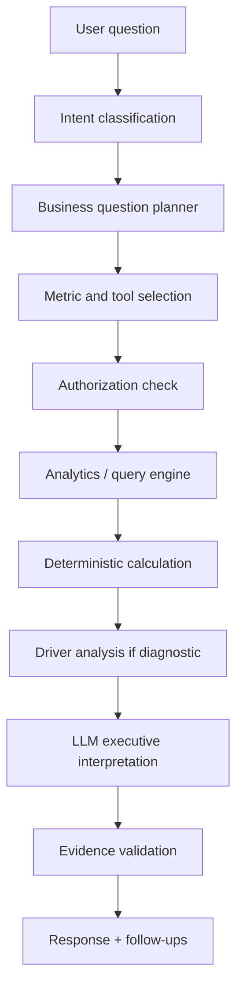

# Architecture — Executive Intelligence Agent

**Version:** 0.1.0  
**Related:** [data-model.md](./data-model.md), [ai-system.md](./ai-system.md), [security.md](./security.md)

---

## 1. Product architecture (logical)

The product is a **read-analyze-advise** layer on Business Central.



**Decision:** the LLM never queries BC or PostgreSQL with generated SQL. It may only call **allow-listed tools** with validated arguments. Tools run tenant-scoped queries in the metric/query engine.

## 2. Recommended technical stack

| Layer | Choice | Rationale |
| --- | --- | --- |
| Frontend | Next.js (App Router), React, TypeScript, Tailwind, shadcn/ui | Fast executive UI, one repo MVP |
| Charts | Recharts | Adequate for sparse executive charts |
| Backend | Next.js Route Handlers + domain services | Clear boundaries; extract workers later |
| DB | PostgreSQL | Relational financial data, strong constraints |
| ORM | Prisma | Typed models; Decimal for money |
| Money math | Prisma `Decimal` + `decimal.js` | No IEEE floats in domain math |
| Cache | Redis | Session, sync locks, metric cache |
| Jobs | BullMQ on Redis | Sync, briefing, alerts; Azure-portable |
| Authn (app) | Auth.js (NextAuth) with Microsoft Entra ID first | Enterprise identity; room for more IdPs |
| Authn (BC) | OAuth 2.0 / Entra confidential client | Official BC path |
| AI | Provider interface (`LLMProvider`) — OpenAI, Azure OpenAI, Anthropic | No single-model lock-in |
| Observability | Pino structured logs + OpenTelemetry traces | AI spans with redaction |
| Hosting | Azure App Service / Container Apps + Azure Database for PostgreSQL + Azure Cache | Microsoft ecosystem, still portable via containers |

**Later analytics (not MVP):** ClickHouse, Fabric, Synapse, or Snowflake behind the same metric interface (`AnalyticsStore`).

## 3. System architecture



**Process split (MVP):**

- **Web process:** UI, auth, chat orchestration, read APIs
- **Worker process:** BC sync, briefing generation, alert evaluation

Same codebase, two entrypoints (`app` vs `jobs`).

## 4. Frontend architecture

- App Router, server components for shells, client components for chat and selectors
- Feature folders: `features/chat`, `features/dashboard`, `features/onboarding`, `features/evidence`
- All data mutations go through server actions or route handlers that enforce RBAC
- Company, period, and comparison live in URL + server session so they cannot be “forgotten” by the model without the UI showing them

## 5. Backend architecture (domain services)

Do not put business logic in React components or in Prisma client calls scattered across routes.

| Service | Responsibility |
| --- | --- |
| `TenantService` | Tenant lifecycle |
| `AccessControl` | RBAC + company + G/L sensitivity |
| `BusinessCentralConnector` | Adapter over official APIs only |
| `SyncService` | Cursors, retries, completeness |
| `MetricEngine` | Deterministic metrics |
| `QueryTools` | Allow-listed analytical tools |
| `Orchestrator` | Intent → plan → tools → validate → LLM |
| `EvidenceService` | Persist claim ↔ calculation |
| `AuditService` | AI and admin audit |
| `BriefingService` | Morning CEO briefing |
| `AlertService` | Threshold evaluation |
| `ScenarioService` | Phase 7 |
| `ForecastService` | Phase 7 statistical models |

## 6. AI orchestration (summary)

Full design: [ai-system.md](./ai-system.md).



Specialist “agents” (CFO, Sales, Inventory, Collections, Executive) are **prompt + tool-profile modules** behind one orchestrator, not a multi-agent runtime in MVP.

## 7. Business Central integration

### Connector abstraction

```text
BusinessCentralConnector
  getCompanies()
  getCustomers() / getVendors() / getItems()
  getGLAccounts() / getGLEntries()
  getSalesInvoices() / getSalesInvoiceLines()
  getPurchaseInvoices() / getPurchaseInvoiceLines()
  getSalesOrders() / getPurchaseOrders()
  getBankAccounts()
  getDimensions()
  getAgedReceivables() / getAgedPayables()   -- if API available
  getCustomerLedgerEntries()                 -- standard if present, else custom API
  getVendorLedgerEntries()
  getItemLedgerEntries()
  getValueEntries()
  getBudgets()
```

### Official sources (do not invent endpoints)

Use Microsoft-supported **Business Central API v2.0** (and newer stable API versions when available), for example:

- `companies`
- `customers`, `vendors`, `items`
- `accounts` (chart of accounts)
- `generalLedgerEntries`
- `salesInvoices`, `salesInvoiceLines`
- `purchaseInvoices`, `purchaseInvoiceLines`
- `salesOrders`, `purchaseOrders`
- `bankAccounts`
- `dimensions`, `dimensionValues`
- company information / currencies as documented

**Not assumed as standard REST resources** until verified per BC version:

- customer/vendor ledger entries
- item ledger / value entries
- G/L budgets
- detailed payment application history

**Strategy when missing:** ship a **BC AL API page extension pack** (optional per customer) exposing those tables as custom APIs. The connector selects `standard | customExtension | unavailable`. The metric engine must degrade with `insufficient_evidence`, never fake rows.

### Connector capabilities

- Multiple Entra tenants / BC tenants
- Multiple environments (production, sandbox)
- Multiple companies
- OAuth token refresh; tokens only in secret store
- Pagination, retry with Retry-After, throttle budget
- Incremental sync via `odata.maxpagesize` + change tracking / `lastModifiedDateTime` where the API supports it
- Schema adapter map per connection (custom fields as JSON, not core columns)

## 8. Semantic layer

LLM sees **metrics, dimensions, and evidence**, not raw table dumps.

```text
BC APIs → Canonical entities (Postgres) → Metric snapshots / on-demand queries → Tools → LLM
```

## 9. Database

PostgreSQL + Prisma. Schema concepts in [data-model.md](./data-model.md) and `prisma/schema.prisma`.

Every operational and analytical row that is tenant-owned includes `tenantId`. Company-scoped facts include `companyId`. Unique indexes always include tenant (and company where applicable).

## 10. Caching

| Cache | Use |
| --- | --- |
| Redis metric cache | Key: tenant, company, metric, period, filters, as-of sync version |
| Redis sync lock | One active sync per connection+company |
| HTTP | No caching of tenant data on CDN |

Invalidate metric cache when a sync for that company completes.

## 11. Background jobs

| Job | Trigger |
| --- | --- |
| `bc.sync.full` | Onboarding |
| `bc.sync.incremental` | Schedule (e.g. 15–60 min) |
| `briefing.generate` | Daily per user timezone / on demand |
| `alerts.evaluate` | After successful sync |
| `health.score` | After sync (Phase 7) |

Jobs carry `tenantId` and `companyId` in the payload; workers re-check isolation.

## 12. Observability

- Request ID on every API and analysis run
- Logs: tenant, user, company, route, duration — never tokens or full prompts with PII dumps
- Trace: orchestrator steps, tool names, token counts
- Sync metrics: pages, rows, lag, error class (auth, throttle, schema)

## 13. Deployment

- Containers: `web` and `worker`
- Azure-first: Container Apps, PostgreSQL Flexible Server, Redis, Key Vault
- Env via Key Vault / container secrets
- Separate production and sandbox BC connections in-app; never mix in one sync cursor

## 14. Folder structure

```text
/app                          # Next.js App Router
/components                   # shared UI
/features
  /chat
  /dashboard
  /onboarding
  /evidence
  /alerts
  /settings
/domain                       # entities, money, period, errors
/analytics
  /metrics
  /drivers
  /scenarios
  /anomalies
  /forecasting
/agents
  /executive
  /cfo
  /sales
  /inventory
  /collections
  /operations
  /forecast
  /risk
/ai
  /orchestrator
  /intents
  /planner
  /prompts
  /providers
  /validation
/connectors
  /business-central
    /auth
    /resources
    /pagination
    /errors
/auth
/security
  /rbac
  /injection
/db
/jobs
/lib
/types
/tests
  /metrics
  /currency
  /ai-eval
/docs
/prompts
/prisma
```

No giant “god” files: one metric per module, one BC resource mapper per entity.

## 15. Multi-tenant architecture (summary)

```text
Tenant
  → Memberships (User, Role)
  → BusinessCentralConnection (Entra + BC tenant)
      → Environment (name, kind: sandbox|production, base URL)
          → Company
              → Canonical ERP facts
              → Metric snapshots, alerts, conversations
```

Enforcement: Prisma middleware / extension **and** explicit `where: { tenantId }` in every query. Tests attempt cross-tenant reads and must fail.

Detail: [security.md](./security.md).

## 16. Development phases

See [roadmap.md](./roadmap.md) for the sequential task list.

| Phase | Name | Outcome |
| --- | --- | --- |
| 0 | Foundation | This pack + Prisma schema + standards |
| 1 | Platform | Next.js, auth, tenant, RBAC, audit |
| 2 | Business Central | OAuth, company, sync, monitoring |
| 3 | Analytics | Metric engine, compare, evidence, tests |
| 4 | AI | Orchestrator, tools, executive copy |
| 5 | Executive UI | Dashboard, chat, evidence drawer |
| 6 | Intelligence | Drivers, briefing, alerts, recs |
| 7 | Advanced | Forecast, scenario, health, anomalies |
