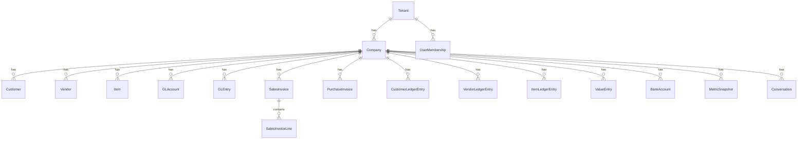
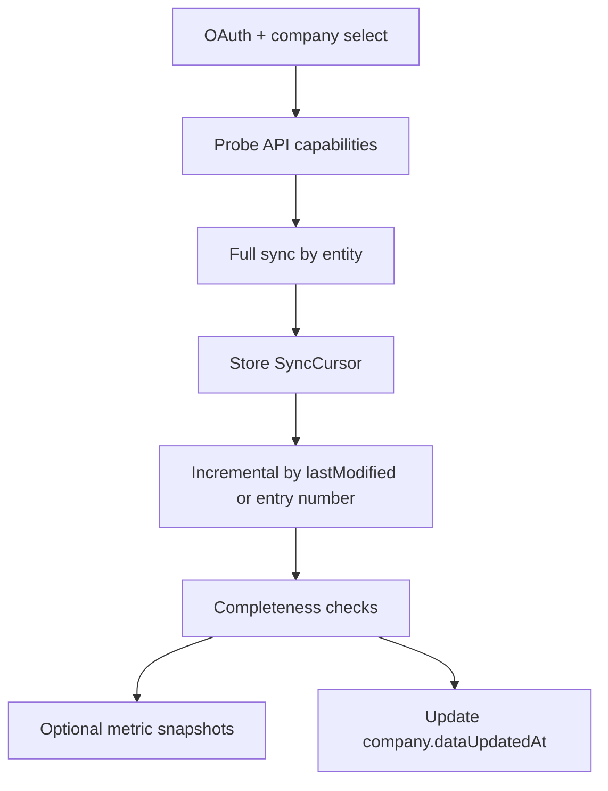

# Data Model — Canonical Analytics Layer

**Version:** 0.1.0  
**Related:** `prisma/schema.prisma`, [metrics.md](./metrics.md)

The LLM does not interpret raw Business Central tables independently on each question. Sync maps BC into a **canonical model**. Metrics read the canonical model (or snapshots derived from it).

---

## 1. Business Central source entities (MVP)

### Standard API v2.0 (expected)

| Canonical entity | Typical BC API resource | Keys / notes |
| --- | --- | --- |
| Company | `companies` | BC company id + name |
| Customer | `customers` | number, displayName, blocked, currency |
| Vendor | `vendors` | same pattern |
| Item | `items` | type, unit cost, inventory (on-hand may be incomplete) |
| GLAccount | `accounts` | number, name, category, indented |
| GLEntry | `generalLedgerEntries` | postingDate, amount, account, document |
| SalesInvoice | `salesInvoices` | posted invoices; status, customer, dates, totals |
| SalesInvoiceLine | `salesInvoiceLines` | item, qty, amounts, discounts |
| PurchaseInvoice | `purchaseInvoices` | vendor, dates, totals |
| PurchaseInvoiceLine | `purchaseInvoiceLines` | item, qty, amounts |
| SalesOrder | `salesOrders` | open demand |
| PurchaseOrder | `purchaseOrders` | purchase commitments |
| BankAccount | `bankAccounts` | balances — confirm field availability per version |
| Dimension | `dimensions` / `dimensionValues` | not required for Phase 1 chat |
| Currency | company / currency APIs | ISO code |

### Often missing from standard APIs — extension strategy

| Canonical entity | Why needed | If unavailable |
| --- | --- | --- |
| CustomerLedgerEntry | AR ageing, overdue, remaining amount, due date | Custom API page on `Cust. Ledger Entry` |
| VendorLedgerEntry | AP, DPO | Custom API on `Vendor Ledger Entry` |
| ItemLedgerEntry | stock movement, ageing proxy | Custom API on `Item Ledger Entry` |
| ValueEntry | true COGS / item profitability | Custom API on `Value Entry` |
| Payment / application | payment behaviour, DSO quality | Detailed Cust. Ledg. Entry API |
| Budget | variance | G/L Budget Entry API |
| ExchangeRate | multi-currency | Currency Exchange Rate API |

The connector records `sourceMode`: `standard_api` | `custom_api` | `unavailable`.

**Never invent an undocumented Microsoft endpoint.** If a customer cannot install the AL pack, metrics that need ledger remaining amounts fall back to invoice-based approximations **only if labelled** (`calculation_basis: invoice_open_estimate`) or return insufficient evidence.

---

## 2. Canonical entities and relationships

### Identity rules

- `id` is our UUID.
- `externalId` is the BC system id (GUID) when present.
- `externalNumber` is the BC number (customer no., doc no.).
- Uniqueness: `(tenantId, companyId, externalId)` or `(tenantId, companyId, externalNumber)` as appropriate.

---

## 3. Synchronization strategy

| Topic | Rule |
| --- | --- |
| Order | Reference data (company, currency, accounts, customers, vendors, items) before transactions |
| Pagination | Follow `@odata.nextLink`; never assume page size |
| Throttle | Honor `429` / Retry-After; jittered backoff; per-connection budget |
| Retry | Transient vs auth vs schema; dead-letter after N attempts |
| Idempotency | Upsert on external id |
| Deletes | Soft-delete if BC omits record on delta; periodic reconcile job |
| Cursors | Per `(connection, environment, company, entity)` |
| Completeness | Minimum row counts + date coverage for last N fiscal periods |
| Demo | `source = demo_seed` bypasses BC; same canonical tables |

---

## 4. Financial modelling considerations

### Dates (never collapse)

| Date | Use |
| --- | --- |
| `postingDate` | Accounting period metrics (revenue, P&L, G/L) |
| `documentDate` / `invoiceDate` | Commercial recognition when required |
| `dueDate` | Overdue, collections |
| `closedAt` / `lastPaymentDate` | Payment behaviour |

A metric definition names **exactly one primary date field**.

### Accounting signs

Business Central G/L and ledger remaining amounts follow BC conventions (debit/credit, inverted remaining for credit memos). The mapper normalizes to:

- **Revenue:** positive = sales credit in P&L terms
- **Expense:** positive = cost
- **AR remaining:** positive = customer owes us
- **AP remaining:** positive = we owe vendor
- **Cash:** positive = funds on hand
- **Inventory value:** positive = on-hand value

Mappers include tests against known BC fixtures (invoice, credit memo, payment, application).

### COGS / gross profit

**Preferred:** Value entries (actual cost).  
**Fallback:** Sales line amount − (qty × unit cost) with `confidence: medium` and explicit limitation.  
**If neither:** Gross profit metric is `unavailable`.

### Operating profit / EBITDA

Requires a **G/L account map** per company (income statement grouping). Without mapping, Operating Profit is unavailable — do not guess from account numbers like “6110”.

---

## 5. Dimensions

Phase 1: optional storage of dimension set IDs on invoices/G/L if APIs provide them.

Phase 2+: breakdown by global dimensions (region, department) via a `DimensionAssignment` table. Core product must not hard-code one customer’s dimension codes.

---

## 6. Currencies

| Field | Meaning |
| --- | --- |
| `currencyCode` | Transaction currency |
| `amount` | Transaction amount |
| `amountLcy` | Amount in company base currency (LCY) |
| `exchangeRate` | If provided |

**Rule:** aggregate only in a single reporting currency. Default = company LCY. Convert using stored `amountLcy` from BC rather than re-deriving rates unless rates are synced.

Display layer formats INR using crore/lakh **for UI only**. Storage is decimal in major units (e.g. rupees), never float.

---

## 7. Fiscal periods

`FiscalPeriod` is derived from company accounting periods if API/extension provides them; otherwise calendar months with a warning on the company: `fiscalCalendar: assumed_calendar_month`.

Metrics always take an explicit `PeriodSpec`: `{ type, start, end, compareStart, compareEnd }`.

---

## 8. Platform entities (SaaS)

Tenant, User, Membership, Role, Permission, BusinessCentralConnection, BusinessCentralEnvironment, Company, SyncJob, SyncCursor, Conversation, Message, AnalysisRun, Evidence, AuditLog, Alert, MetricDefinition, MetricSnapshot.

Tokens: `encryptedAccessToken`, `encryptedRefreshToken` — application-level encryption, never logged.

---

## 9. Prisma

The initial schema lives at [`prisma/schema.prisma`](../prisma/schema.prisma).

Money fields use `Decimal(19, 4)` (or 2 where currency minor units are 2 — still Decimal, never Float).

Required indexes:

- `(tenantId, companyId, postingDate)` on journals and invoices
- `(tenantId, companyId, customerId, dueDate)` on AR ledgers
- `(tenantId, companyId, metricId, periodEnd)` on snapshots
