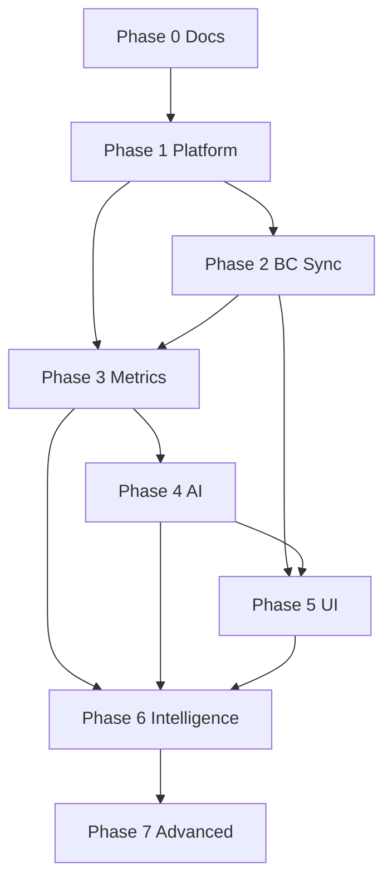

# Development Roadmap and Sequential Task List

**Version:** 0.1.0  

This is the **build order**. Complete tasks top-to-bottom. Do not skip P0 items. At the start of each milestone: state objective, affected files, architecture decisions, implement, test, fix, security review, update docs, summarize.

Application code starts at **Task 1.1**, only after Phase 0 documents are accepted.

---

## Phase 0 — Foundation (this delivery)

| Seq | Task ID | Task | Depends on | Done when |
| --- | --- | --- | --- | --- |
| 0.1 | DOC-01 | Product specification | — | `docs/product-spec.md` |
| 0.2 | DOC-02 | Top 50 questions | DOC-01 | `docs/executive-questions.md` |
| 0.3 | DOC-03 | System architecture | DOC-01 | `docs/architecture.md` |
| 0.4 | DOC-04 | Data model narrative | DOC-03 | `docs/data-model.md` |
| 0.5 | DOC-05 | Prisma schema draft | DOC-04 | `prisma/schema.prisma` |
| 0.6 | DOC-06 | Metric catalogue | DOC-04 | `docs/metrics.md` |
| 0.7 | DOC-07 | AI system design | DOC-03 | `docs/ai-system.md` |
| 0.8 | DOC-08 | Security & tenancy | DOC-03 | `docs/security.md` |
| 0.9 | DOC-09 | UX spec | DOC-01 | `docs/ux.md` |
| 0.10 | DOC-10 | MVP backlog | all above | `docs/mvp-backlog.md` |
| 0.11 | DOC-11 | Sequential roadmap | DOC-10 | this file |
| 0.12 | DOC-12 | Risks | DOC-03 | `docs/risks.md` |
| 0.13 | DOC-13 | System prompt v1 | DOC-07 | `prompts/executive-advisor.v1.md` |
| 0.14 | DOC-14 | Architecture index | all docs | `docs/README.md` |

**Milestone exit:** Internal consistency across metrics, BC sources, tools, RBAC, and backlog IDs.

---

## Phase 1 — Platform

**Objective:** Runnable multi-tenant app shell with auth, RBAC, audit. No BC required.

| Seq | Task ID | Backlog | Task | Depends on |
| --- | --- | --- | --- | --- |
| 1.1 | ENG-001 | MVP-001 | Scaffold Next.js + TS + Tailwind + shadcn + folder tree | Phase 0 |
| 1.2 | ENG-002 | MVP-001 | Add Vitest, ESLint, Prettier, CI workflow | 1.1 |
| 1.3 | ENG-003 | MVP-001 | Engineering standards: decimal policy, env template | 1.1 |
| 1.4 | ENG-004 | MVP-002 | Docker Compose Postgres + Redis | 1.1 |
| 1.5 | ENG-005 | MVP-002 | Prisma migrate initial schema | 1.4, DOC-05 |
| 1.6 | ENG-006 | MVP-003 | Auth.js Microsoft Entra login | 1.1 |
| 1.7 | ENG-007 | MVP-004 | Tenant + first Owner membership | 1.5, 1.6 |
| 1.8 | ENG-008 | MVP-005 | AccessControl service + role seeds | 1.7 |
| 1.9 | ENG-009 | MVP-006 | AuditLog helper + API middleware request IDs | 1.7 |
| 1.10 | ENG-010 | MVP-005 | Integration tests: cross-tenant denied | 1.8 |

**Exit:** User can sign in, belong to a tenant, hit a hello API that is tenant-scoped.

---

## Phase 2 — Business Central

**Objective:** Connect, discover company, sync core entities, monitor. Mock path for demo.

| Seq | Task ID | Backlog | Task | Depends on |
| --- | --- | --- | --- | --- |
| 2.1 | ENG-011 | MVP-007 | Connector interface + MockConnector | 1.1 |
| 2.2 | ENG-012 | MVP-007 | HTTP adapter: API v2 URLs, pagination, 429 | 2.1 |
| 2.3 | ENG-013 | MVP-008 | BC OAuth + encrypted token store | 1.6, 1.7 |
| 2.4 | ENG-014 | MVP-009 | Environment + company discovery | 2.2, 2.3 |
| 2.5 | ENG-015 | MVP-009 | Capability probe (standard vs missing) | 2.4 |
| 2.6 | ENG-016 | MVP-010 | BullMQ worker process + sync lock | 1.4 |
| 2.7 | ENG-017 | MVP-010 | SyncCursor + full/incremental jobs | 2.6, 2.4 |
| 2.8 | ENG-018 | MVP-011 | Map customers, vendors, items | 2.7 |
| 2.9 | ENG-019 | MVP-011 | Map sales/purchase invoices and lines | 2.8 |
| 2.10 | ENG-020 | MVP-011 | Map G/L accounts and entries | 2.8 |
| 2.11 | ENG-021 | MVP-011 | Map bank accounts | 2.8 |
| 2.12 | ENG-022 | MVP-012 | Ledger mappers + fallback policy | 2.9 |
| 2.13 | ENG-023 | MVP-012 | Draft AL API extension spec (docs only if not shipping AL yet) | 2.15 |
| 2.14 | ENG-024 | MVP-013 | Sync status API + settings UI | 2.7 |
| 2.15 | ENG-025 | MVP-010 | Completeness validation | 2.12 |

**Exit:** Demo mock sync fills canonical tables; live path implemented behind OAuth.

---

## Phase 3 — Analytics

**Objective:** Trusted metrics, compare, breakdown, evidence, tests.

| Seq | Task ID | Backlog | Task | Depends on |
| --- | --- | --- | --- | --- |
| 3.1 | ENG-026 | MVP-019 | Deterministic demo seed (12+ months, storyline) | 1.5 |
| 3.2 | ENG-027 | MVP-014 | Money + PeriodSpec + fiscal calendar | 1.5 |
| 3.3 | ENG-028 | MVP-015 | Metric registry | 3.2 |
| 3.4 | ENG-029 | MVP-015 | Revenue, GP, GM | 3.1, 3.3 |
| 3.5 | ENG-030 | MVP-015 | Cash, AR, AP, Inventory, WC | 3.4 |
| 3.6 | ENG-031 | MVP-015 | DSO, DPO, Operating Profit (mapped) | 3.5 |
| 3.7 | ENG-032 | MVP-016 | compareMetric + breakdownMetric | 3.6 |
| 3.8 | ENG-033 | MVP-017 | Evidence writer | 3.7, 1.9 |
| 3.9 | ENG-034 | MVP-018 | Fixture tests (signs, dates, FX, overdue) | 3.6 |
| 3.10 | ENG-035 | MVP-015 | Metric cache keyed by sync version | 3.6, 2.7 |

**Exit:** All M01–M11 tested on demo seed.

---

## Phase 4 — AI

**Objective:** Question → tools → facts → validated executive answer.

| Seq | Task ID | Backlog | Task | Depends on |
| --- | --- | --- | --- | --- |
| 4.1 | ENG-036 | MVP-020 | LLMProvider interface + one impl + fake provider for tests | 1.1 |
| 4.2 | ENG-037 | MVP-021 | Intent classifier | 4.1 |
| 4.3 | ENG-038 | MVP-021 | Planner JSON schema | 4.2, 3.3 |
| 4.4 | ENG-039 | MVP-022 | Tool gateway + authz | 4.3, 1.8, 3.7 |
| 4.5 | ENG-040 | MVP-023 | Load prompt v1; facts JSON; generator | 4.4 |
| 4.6 | ENG-041 | MVP-023 | Evidence validator + repair + fallback | 4.5, 3.8 |
| 4.7 | ENG-042 | MVP-024 | Conversation + state | 4.5 |
| 4.8 | ENG-043 | MVP-025 | Follow-up generator | 4.5 |
| 4.9 | ENG-044 | MVP-006 | Persist AnalysisRun | 4.6 |
| 4.10 | ENG-045 | MVP-039 | Golden eval subset (descriptive/lookup) | 4.6, 3.1 |

**Exit:** CLI or API chat on demo company answers Q02, Q10, Q15, Q16, Q17, Q47 correctly.

---

## Phase 5 — Executive UI

**Objective:** Owner-usable product on demo or connected BC.

| Seq | Task ID | Backlog | Task | Depends on |
| --- | --- | --- | --- | --- |
| 5.1 | ENG-046 | MVP-026 | Login + onboarding wizard (incl. demo skip) | 2.4, 3.1 |
| 5.2 | ENG-047 | MVP-027 | Dashboard shell + header selectors + freshness | 5.1, 3.6 |
| 5.3 | ENG-048 | MVP-027 | Metric cards | 5.2 |
| 5.4 | ENG-049 | MVP-028 | Chat page + streaming | 4.5, 5.2 |
| 5.5 | ENG-050 | MVP-028 | Evidence drawer + action buttons | 4.6, 5.4 |
| 5.6 | ENG-051 | MVP-028 | Follow-up chips + scope chips | 4.7, 4.8 |
| 5.7 | ENG-052 | MVP-029 | Settings: connection, users, locale | 1.8, 2.13 |
| 5.8 | ENG-053 | MVP-039 | Expand golden set toward 50 | 4.10 |
| 5.9 | ENG-054 | — | Security review: headers, cookies, rate limit | 5.4 |

**Exit:** Definition of MVP success for descriptive/lookup/comparative questions. Diagnostics may still be “coming” unless Phase 6 started.

---

## Phase 6 — Intelligence

**Objective:** WHY, briefing, call list, alerts, recs.

| Seq | Task ID | Backlog | Task | Depends on |
| --- | --- | --- | --- | --- |
| 6.1 | ENG-055 | MVP-030 | Driver decomposition (GP, revenue, AR) | 3.7 |
| 6.2 | ENG-056 | MVP-030 | Wire diagnostic intent to drivers | 6.1, 4.3 |
| 6.3 | ENG-057 | MVP-031 | Collections score + call list tool | 3.6 |
| 6.4 | ENG-058 | MVP-033 | Priority engine (impact × urgency × confidence × controllability) | 6.1, 6.3 |
| 6.5 | ENG-059 | MVP-033 | Recommendation objects + no fake impacts | 6.4 |
| 6.6 | ENG-060 | MVP-032 | BriefingService + daily job | 6.5, 4.5 |
| 6.7 | ENG-061 | MVP-032 | Briefing UI on dashboard | 6.6, 5.2 |
| 6.8 | ENG-062 | MVP-034 | Alert definitions + evaluator | 3.6 |
| 6.9 | ENG-063 | MVP-034 | In-app notification center | 6.8 |
| 6.10 | ENG-064 | MVP-039 | Diagnostic golden questions | 6.2 |

**Exit:** Q05, Q11, Q12, Q18, Q32, Q36 answered with evidence on demo.

---

## Phase 7 — Advanced intelligence

| Seq | Task ID | Backlog | Task | Depends on |
| --- | --- | --- | --- | --- |
| 7.1 | ENG-065 | MVP-035 | Statistical cash/revenue forecast service | 3.6 |
| 7.2 | ENG-066 | MVP-036 | Scenario engine + UI disclaimer | 3.6 |
| 7.3 | ENG-067 | MVP-037 | Health score + methodology page | 3.6 |
| 7.4 | ENG-068 | MVP-038 | Anomaly service | 3.6 |
| 7.5 | ENG-069 | — | Wire predictive/scenario/anomaly intents | 7.1–7.4, 4.3 |
| 7.6 | ENG-070 | MVP-039 | Full 50-question eval | 7.5 |

**Exit:** Q39–Q46 without mixing scenario and actuals.

---

## After MVP (Phase 8+ — not scheduled in detail)

- Optional BC AL extension package in-repo
- Email/Teams/Slack adapters
- Microsoft Fabric / warehouse `AnalyticsStore`
- Document knowledge with `erp_fact` vs `document_knowledge`
- Write-back (collections tasks) only with new security review
- Multi-company consolidation

---

## Dependency graph (high level)

---

## Working agreement (every engineering milestone)

1. Explain objective  
2. List affected files  
3. Record architecture decisions  
4. Implement (no fake finished stubs)  
5. Add tests  
6. Run tests  
7. Fix failures  
8. Review security  
9. Update docs  
10. Completion summary  

If BC credentials are missing, use MockConnector and demo seed — never fake production numbers in a live company.
